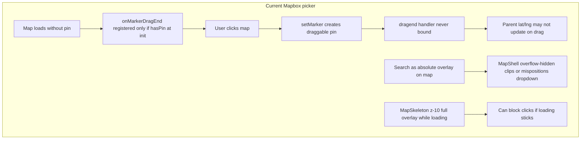

# Fix map click/drag and search dropdown on all pickers

## Problem summary

Users see the hint **«انقر على الخريطة أو اسحب الدبوس لتحديد موقع المعاينة»** but must **search first** before they can place or drag a pin. Search suggestions also appear **at the bottom of the map** instead of under the search box.

## Root causes (from code review)

1. **Drag handler not rebound after pin creation** — In `[frontend/src/lib/maps/core/instance.js](frontend/src/lib/maps/core/instance.js)`, `onMarkerDragEnd()` returns early if `marker` is null. It is only called at init when `hasPin` is true. After a map click or search select, `setMarker()` creates a new marker but **never attaches `dragend**`, so drag appears broken until a flow that re-inits the map (often after search + state update).
2. **Search UI layout** — `[MapboxLocationMapPicker.jsx](frontend/src/components/maps/MapboxLocationMapPicker.jsx)` places `[MapSearchBar](frontend/src/components/maps/shell/MapSearchBar.jsx)` as an **absolute overlay** on the map. `[MapShell](frontend/src/components/maps/shell/MapShell.jsx)` `property` variant uses `**overflow-hidden**`, which clips the autocomplete list (`absolute top-full`). Visually this often looks like results at the wrong place or cut off at the bottom of the map.
3. **Reference UX already works on OSM** — `[OsmLocationMapPicker.jsx](frontend/src/components/maps/OsmLocationMapPicker.jsx)` puts search **above** the map in normal flow (`border-b p-3`) and uses Leaflet `useMapEvents({ click })` + `Marker` `dragend` — this is the pattern to match for Mapbox.

All editable screens route through `**UserLocationPicker` → `MapboxLocationMapPicker**` when Manfith is active (`[MAP_PICKER_EDIT_PROPS](frontend/src/lib/maps/mapPickerUi.js)`): `/add` property, purchase, wholesale checkout, my bids order form, profile edit, view-at-location modal, etc.

## Implementation plan

### 1. Fix marker lifecycle in map API (core)

**File:** `[frontend/src/lib/maps/core/instance.js](frontend/src/lib/maps/core/instance.js)`

- Keep a module-level `onDragEndHandler` ref inside `buildMapApi`.
- On every `setMarker(lat, lng, { draggable })`, after creating the marker, call an internal `bindMarkerDragEnd()` if a handler was registered.
- Change `onMarkerDragEnd(handler)` to store the handler and bind to the current marker (or no-op until marker exists).
- Ensure `destroy()` clears marker and handler.

This fixes drag-after-click and drag-after-search in one place for every Mapbox picker.

### 2. Re-layout Mapbox picker like OSM (search above map)

**File:** `[frontend/src/components/maps/MapboxLocationMapPicker.jsx](frontend/src/components/maps/MapboxLocationMapPicker.jsx)`

- Move `MapSearchBar` **out of** `absolute inset-x-0 top-0` overlay into a **top section** above the map canvas (same structure as OSM: `border-b border-border/40 p-3`).
- Keep map canvas in a dedicated `relative` child with only: `mapElRef`, `MapChrome`, `MapPickerEmptyHint`.
- In `onMapClick` handler (after `setMarker` + `notifyPick`), no extra work needed once (1) is done; optionally call a small `api.reattachDrag?.()` if exposed.

### 3. Allow search dropdown to render visibly

**Files:** `[frontend/src/components/maps/shell/MapShell.jsx](frontend/src/components/maps/shell/MapShell.jsx)`, optionally `[MapSearchBar.jsx](frontend/src/components/maps/shell/MapSearchBar.jsx)`

- Add prop e.g. `clipOverflow={false}` (default `true` for embeds) for picker shells; when false, use `overflow-visible` on the shell wrapper (keep `rounded-2xl` on an inner clip layer only if needed for map tiles).
- **Or** render autocomplete in a **Portal** anchored to the input (`getBoundingClientRect`) so it is never clipped — use if overflow change affects rounded corners.

Prefer **search-above-map + overflow-visible** first (simpler, matches OSM).

### 4. Never block map interaction while loading

**Files:** `[MapShell.jsx](frontend/src/components/maps/shell/MapShell.jsx)`, `[MapSkeleton.jsx](frontend/src/components/maps/shell/MapSkeleton.jsx)`

- Add `pointer-events-none` to the loading skeleton overlay so a delayed `setLoading(false)` cannot permanently block clicks.
- After `map.once('load')`, call `resize()` + `setLoading(false)` in `finally` so loading always clears on success or failure.

### 5. Align OSM fallback (parity)

**File:** `[OsmLocationMapPicker.jsx](frontend/src/components/maps/OsmLocationMapPicker.jsx)`

- Quick audit: click + drag already wired; ensure `showSearch` default paths match Mapbox layout.
- If Mapbox fails and OSM loads, behavior should feel the same (search on top).

### 6. Optional polish (low risk)

- **MapSearchBar:** add `z-50` on results list; cap height `max-h-48` (already present).
- **MapPickerEmptyHint:** keep `pointer-events-none`; hide when `hasPin` (already).
- **Google fallback** (`[GoogleLocationMapPicker.jsx](frontend/src/components/maps/GoogleLocationMapPicker.jsx)`): only if still hit in prod — ensure map `click` listener sets draggable marker without requiring Places search (out of scope unless user reports Google stack).

## Files touched (expected)

| File                          | Change                            |
| ----------------------------- | --------------------------------- |
| `lib/maps/core/instance.js`   | Rebind drag on `setMarker`        |
| `MapboxLocationMapPicker.jsx` | Search above map; click/drag flow |
| `shell/MapShell.jsx`          | `overflow-visible` for picker     |
| `shell/MapSkeleton.jsx`       | `pointer-events-none`             |
| `OsmLocationMapPicker.jsx`    | Verify parity only                |

No backend changes. No changes to `MAP_PICKER_*` consumers beyond improved picker behavior.

## Manual test checklist

After implementation, verify on **desktop + mobile**:

1. `**/add**` (real estate) — click map without typing in search → pin appears, address reverse-geocodes, drag updates pin.
2. `**/purchase/:id**` — same; search dropdown opens **directly under** search field.
3. **View-at-location modal** on a listing with `view_at_client`.
4. **Profile edit** (dashboard personal data map).
5. **Wholesale checkout** and **My bids → create order** map dialogs.
6. Confirm **no search required** before first click/drag.
7. Hard refresh (`Ctrl+Shift+R`) to avoid stale HMR bundle.

## Success criteria

- First interaction: user can **click** or use **locate** to place a pin without searching.
- After pin exists: **drag** updates coordinates and address (reverse geocode).
- Search suggestions appear **under the search input**, not at the bottom of the map.
- Same behavior on all screens using `LocationMapPicker` / `StandardLocationMapField`.

